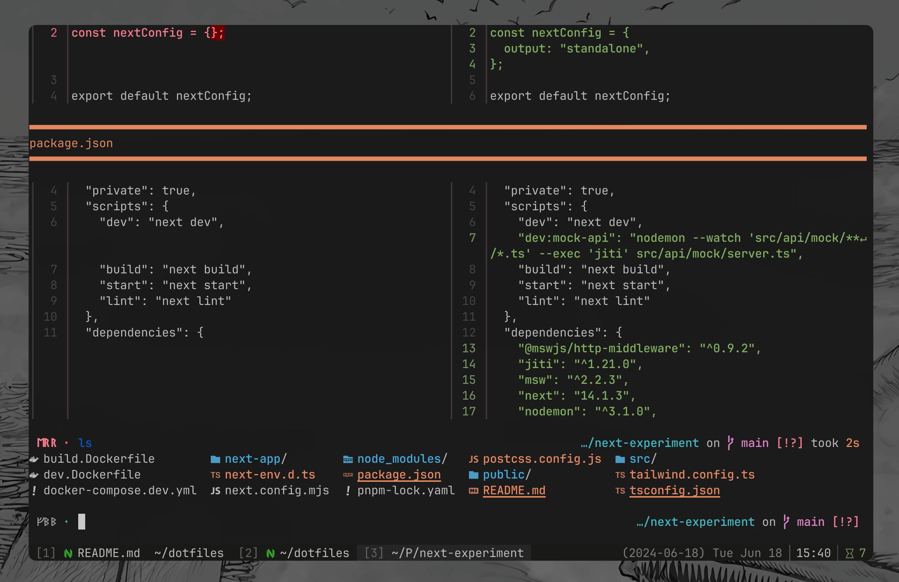
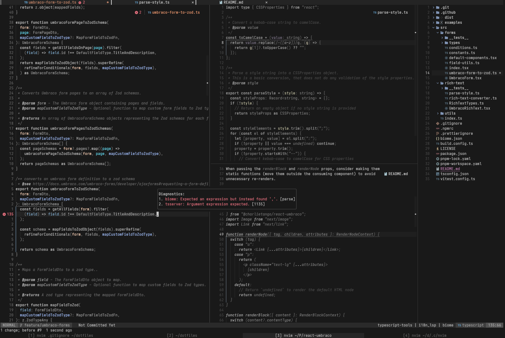

# 🗂️ Dotfiles

Config files and scripts for my development environment.  
Managed with [GNU Stow](https://www.gnu.org/software/stow/) for easy symlink management.

## ⚡ Installation

```sh
# navigate to home directory
cd ~

# clone the repository
git clone git@github.com:fbosch/dotfiles.git

# navigate to the directory
cd dotfiles

# install the dependencies
bash ./scripts/install.sh

# initiate GNU Stow
stow .
```

## What do I use?

### 🖥️ Terminal

I use [WezTerm](https://wezfurlong.org/wezterm/index.html) as my terminal emulator with [fish](https://fishshell.com/) as my primary shell and a minimal configuration of [starship](https://starship.rs/) for my prompt.

#### 🧰 CLI Tooling

- [fzf](https://github.com/junegunn/fzf)
- [zoxide](https://github.com/ajeetdsouza/zoxide)
- [fisher](https://github.com/jorgebucaran/fisher)
- [ripgrep](https://github.com/BurntSushi/ripgrep)
- [bat](https://github.com/sharkdp/bat)
- [fd](https://github.com/sharkdp/fd)
- [lf](https://github.com/gokcehan/lf)
- [eza](https://github.com/eza-community/eza)
- [stow](https://www.gnu.org/software/stow/)
- [git-delta](https://github.com/dandavison/delta)
- [lazygit](https://github.com/jesseduffield/lazygit)

---



> 🎨 colorscheme: [zenwritten dark](https://github.com/zenbones-theme/zenbones.nvim)
> 📓 fonts:
>
> - [Zenbones Brainy](https://github.com/zenbones-theme/zenbones-mono)
> - [JetBrains Mono](https://www.jetbrains.com/lp/mono/)
> - [BabelStone Runic Elder Futhark](https://www.babelstone.co.uk/Fonts/)
> - [Symbols Nerd Font](https://github.com/ryanoasis/nerd-fonts)

### 📝 Editor

I use my own custom configuration for [NeoVim](https://neovim.io/), which is setup and managed with [Lua](https://lua.org/) and [LazyNvim](https://github.com/folke/lazy.nvim).

#### ✨ Features

- [lsp](https://neovim.io/doc/user/lsp.html)
- [treesitter](https://github.com/nvim-treesitter/nvim-treesitter)
- [fzf-lua](https://github.com/ibhagwan/fzf-lua)
- [telescope](https://github.com/nvim-telescope/telescope.nvim)
- [lualine](https://github.com/nvim-lualine/lualine.nvim)
- [autosession](https://github.com/rmagatti/auto-session)

... and more

---



> colorscheme: [zenwritten dark](https://github.com/zenbones-theme/zenbones.nvim)
